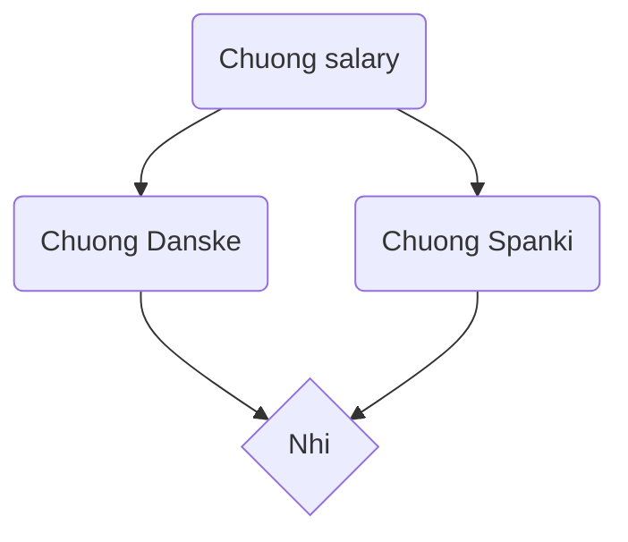

sequenceDiagram
```mermaid
participant browser
participant server

browser ->> server: GET https://studies.cs.helsinki.fi/exampleapp/notes
activate server
server ->> browser: HTML document
deactivate server

Browser ->> server: GET https://studies.cs.helsinki.fi/exampleapp/main.css
activate server
server ->> browser: CSS file
deactivate server


Browser ->> server: GET https://studies.cs.helsinki.fi/exampleapp/main.js
activate server
server ->> browser: JS file
deactivate server

Browser ->> server: GET https://studies.cs.helsinki.fi/exampleapp/data.json
activate server
server ->> browser: [{"content":"Thank you","date":"2024-07-22T19:33:41.378Z"}]
deactivate server

Browser ->> server: POST https://studies.cs.helsinki.fi/exampleapp/data.json with body note=asdf
activate server
server ->> browser: redirect request
deactivate server
(start from Step 1)
```

