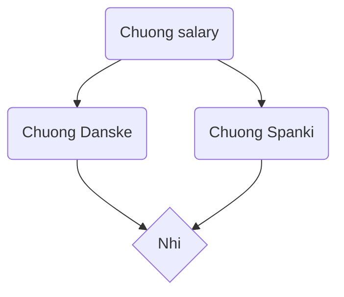
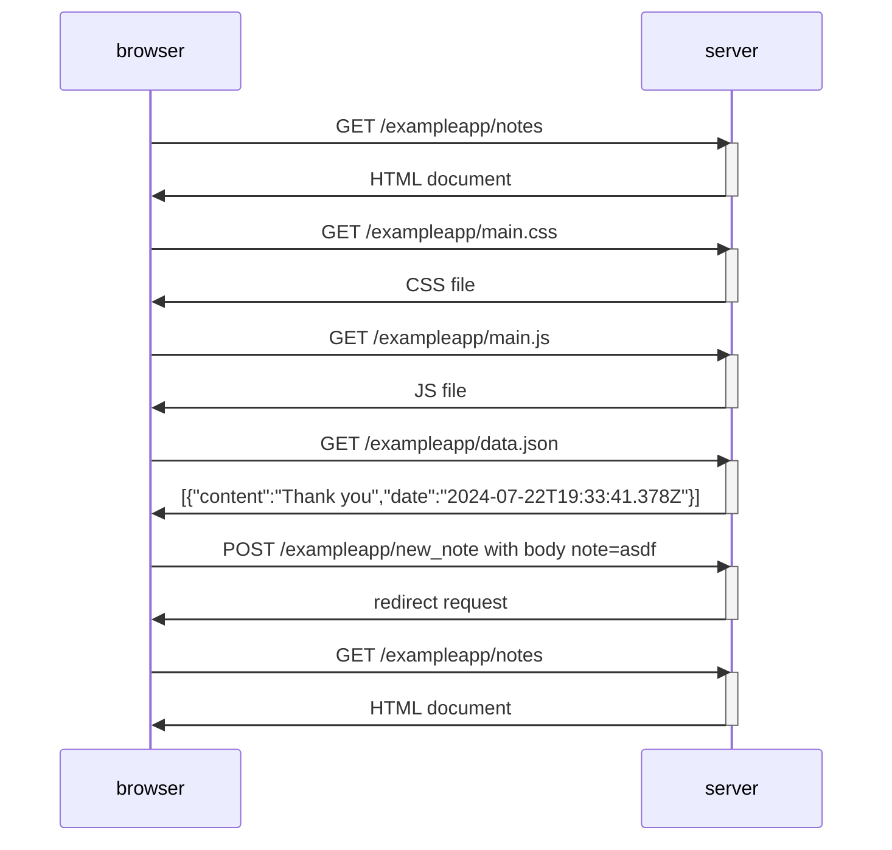

```mermaid
  graph TD;
      A(Chuong salary)-->B(Chuong Danske);
      A(Chuong salary)-->C(Chuong Spanki);
      B(Chuong Danske) -->D{Nhi};
      C(Chuong Spanki)-->D{Nhi};
```

```mermaid
sequenceDiagram
participant browser
participant server

browser ->> server: GET /exampleapp/notes
activate server
server ->> browser: HTML document
deactivate server

browser ->> server: GET /exampleapp/main.css
activate server
server ->> browser: CSS file
deactivate server

browser ->> server: GET /exampleapp/main.js
activate server
server ->> browser: JS file
deactivate server

browser ->> server: GET /exampleapp/data.json
activate server
server ->> browser: [{"content":"Thank you","date":"2024-07-22T19:33:41.378Z"}]
deactivate server

browser ->> server: POST /exampleapp/new_note with body note=asdf
activate server
server ->> browser: redirect request
deactivate server

browser ->> server: GET /exampleapp/notes
activate server
server ->> browser: HTML document
deactivate server
```

