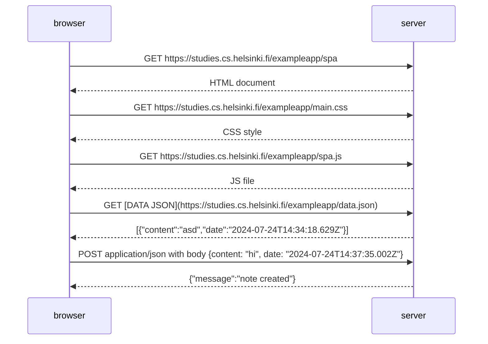

```mermaid
sequenceDiagram
    participant browser
    participant server
    browser->>server: GET https://studies.cs.helsinki.fi/exampleapp/spa
    server-->>browser: HTML document
    browser->>server: GET https://studies.cs.helsinki.fi/exampleapp/main.css
    server-->>browser: CSS style
browser ->>server: GET https://studies.cs.helsinki.fi/exampleapp/spa.js
server -->> browser: JS file
browser ->> server: GET [DATA JSON](https://studies.cs.helsinki.fi/exampleapp/data.json)
server-->> browser: [{"content":"asd","date":"2024-07-24T14:34:18.629Z"}]
    browser->>server: POST application/json with body {content: "hi", date: "2024-07-24T14:37:35.002Z"}
    server-->>browser: {"message":"note created"}
```
